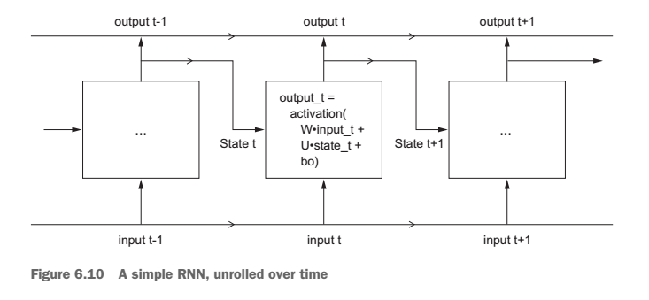

The repository include algorithm questions and solutions in Python. Feel free to email data.intelligence.mastery@gmail.com if you have any questions. Have fun coding!

## 1. General Algorithm

Click to open the [Algorithms Textbook](https://github.com/sudheernaidu53/Data-Structures-and-Algorithms-specialization-University-of-California-San-Diego/blob/master/Algorithmic%20toolbox%20course%201/Alexander%20S.%20Kulikov%2C%20Pavel%20Pevzner%20-%20Learning%20Algorithms%20Through%20Programming%20and%20Puzzle%20Solving%20(2018%2C%20Leanpub).pdf)

Others' work: 

[Reference1](https://github.com/mablatnik/Algorithmic-Toolbox) "Python/Jave/C++"

[Reference2](https://github.com/AbdallahHemdan/Algorithmic-Toolbox-San-Diego) "C++"

## 2. Machine Learning Algorithm

[Machine Learning From Scratch - Github](https://github.com/eriklindernoren/ML-From-Scratch)

[Commonly used Machine Learning Algorithms (with Python and R Codes)](https://www.analyticsvidhya.com/blog/2017/09/common-machine-learning-algorithms/)

## Simple RNN

